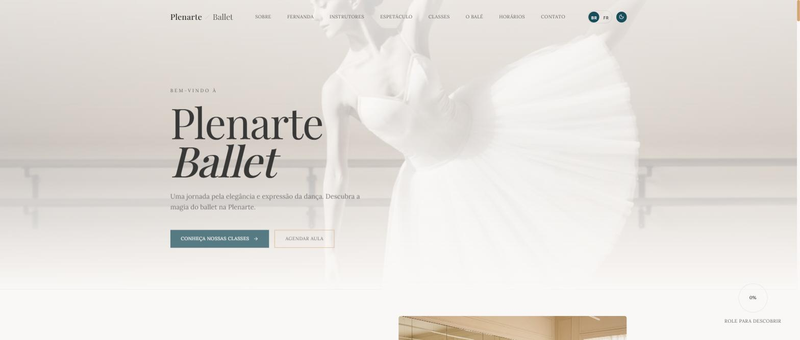

# 🩰 Plenarte Ballet — Case de Projeto

Site institucional desenvolvido para a Plenarte Ballet, escola de dança clássica fundada por Fernanda Abreu. Este repositório é uma vitrine do projeto (case), sem o código-fonte do cliente.

🔗 Site no ar: [plenarteballet.com.br](https://www.plenarteballet.com.br)

## 💭 Sobre o projeto

O site apresenta a proposta pedagógica da escola, o corpo docente, as modalidades de aula e os canais de contato. Inclui seções sobre a diretora fundadora, os instrutores, uma galeria de espetáculos com carrossel responsivo, grade de horários e formulário de contato via WhatsApp.

## ✨ Funcionalidades

Design responsivo com menu hamburger para mobile, suporte a múltiplos idiomas (português, francês, espanhol e inglês), galeria de fotos com carrossel e integração com Google Search Console para SEO.

## 🚀 Tecnologias utilizadas

Next.js (App Router), React, TypeScript, Tailwind CSS, Embla Carousel, Radix UI, Lucide React e Vercel Analytics.

## 👤 Autor

**Davi Montalvão** — [LinkedIn](https://www.linkedin.com/in/davi-montalvao-dev/) • [GitHub](https://github.com/davi-montalvao)

---

Projeto desenvolvido sob demanda para cliente. Codigo-fonte nao disponivel publicamente.
